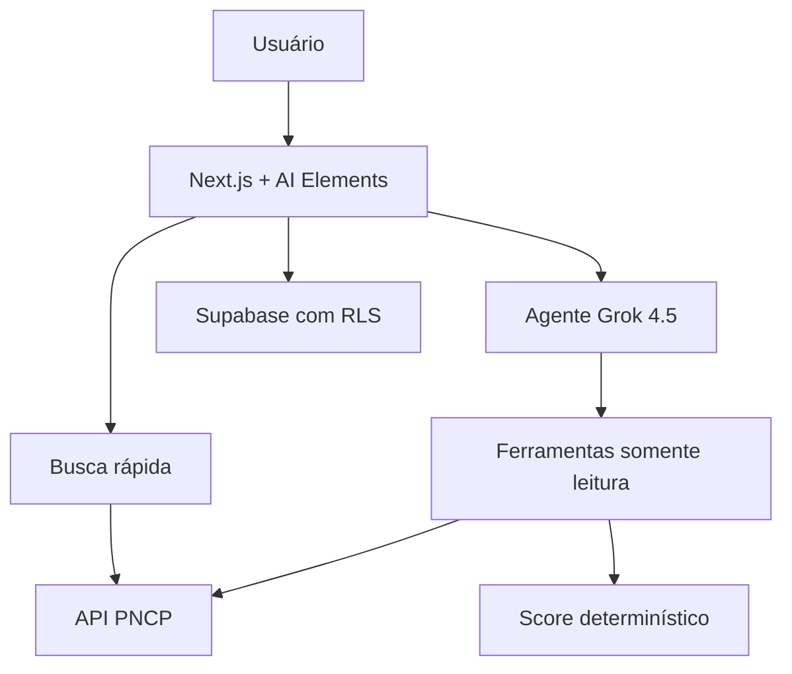

# Arquitetura do Predix Licita

## Problema

O volume e a heterogeneidade das contratações públicas dificultam separar
oportunidades relevantes de ruído. Uma resposta de IA sem rastreabilidade pode
agravar o risco ao inventar requisitos ou ocultar lacunas.

## MVP

- Buscar propostas abertas na API oficial do PNCP.
- Normalizar objeto, órgão, local, prazo, valor, modalidade e link oficial.
- Filtrar por termos e UF.
- Aplicar score determinístico de aderência ao perfil.
- Usar Grok 4.5 para consultar ferramentas e explicar o resultado.
- Salvar oportunidades por usuário.
- Registrar sessões, mensagens e eventos de auditoria no schema.

Fora do MVP: leitura integral de PDFs, preenchimento automático de propostas,
probabilidade de vitória, parecer jurídico e participação autônoma.

## Fluxo

O caminho de busca rápida não chama o modelo. Na conversa, o modelo apenas
orquestra ferramentas de leitura e explica resultados. O score é calculado em
código, não pelo modelo.

## Decisões de confiança

- Dados do PNCP são tratados como entrada não confiável para prevenir prompt
  injection.
- Respostas distinguem fonte oficial, inferência e informação não localizada.
- O link oficial e o instante de coleta acompanham cada registro.
- Requisitos ausentes nunca são inferidos como atendidos.
- O score não representa chance de vitória.
- Ações de escrita não são ferramentas autônomas do agente.

## Evolução

1. Perfil empresarial editável e alertas.
2. Leitura versionada de edital e anexos.
3. Extração estruturada com citação de página.
4. Comparação documental e workflow colaborativo.
5. Novas fontes oficiais, mantendo proveniência por registro.
